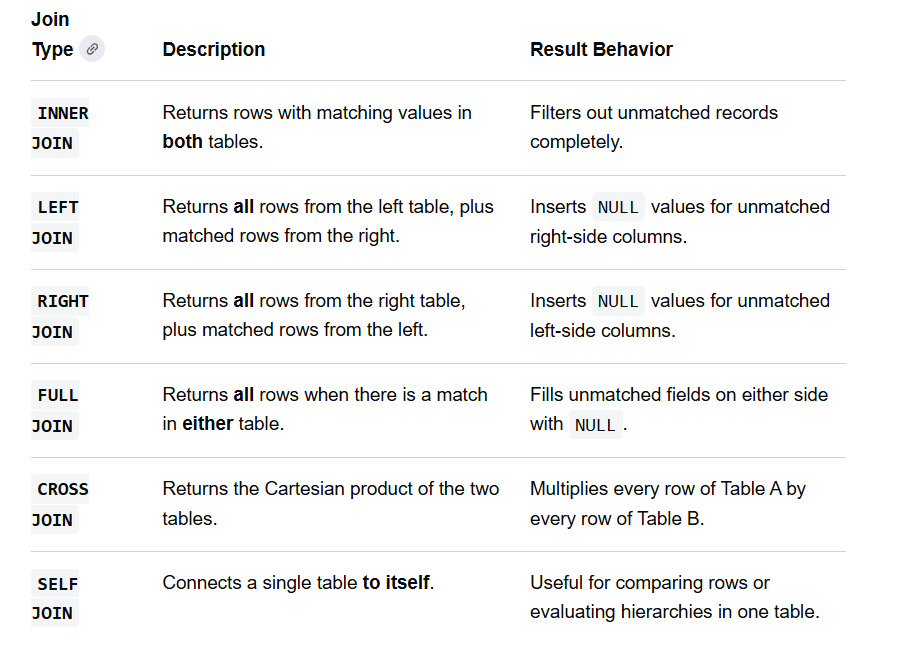

# Joins in SQL:

Joins are the Clause in SQL that helps to combine the rows from 2 or more tables which has some relationshipt between each other.   There are different types of Joins,

- Inner Join (A intersection of B)
- Outer full Join (A union of B)
- Left Outer Join (Only A and Common, No B)
- Right Outer Join (Only B and Common, No A)
- Self Join (Connects a single table to itself.)
- Cross Join

SQL queries will be executed in an order

1. FROM
2. JOINS (CONDITION)
3. WHERE
4. GROUP BY
5. HAVING
6. SELECT
7. ROW_NUMBER()
8. ORDER BY
9. LIMIT

## Self Joins:

A Self-Join is not a distinct SQL keyword; it is simply a regular join where a `table is joined to itself`. This is incredibly useful for evaluating `hierarchical data`, like an organizational chart where employees and their managers live in the same table.  
